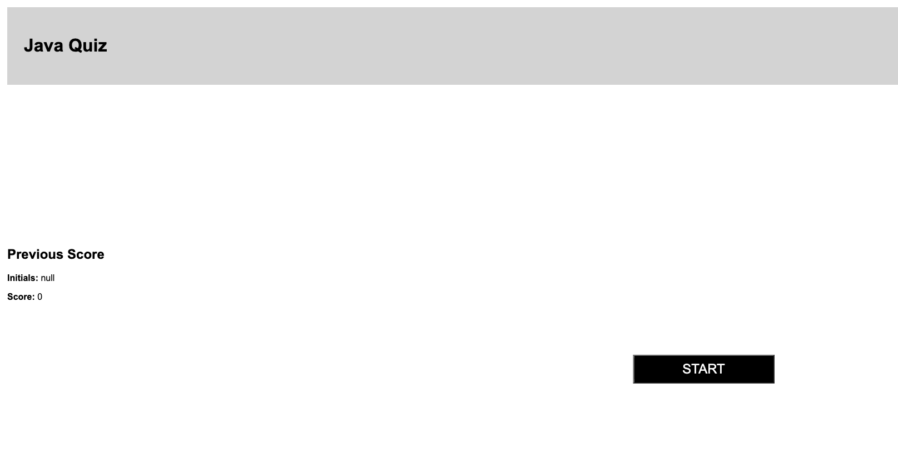

# Homework_04_Quiz


# <BTCMP Homework 4>

## Description
This javascript will randomly generate a password for you... But you must remember that there is no such thing as random for computers.
## Installation
You do not need anything special to run this functioning code. 
Link for deployed repo: https://gannacon.github.io/Homework-03-PasswordGen/
## Assets
Below is a screenshot of the home page.

 

## Credits
I give credit to Byron and Chris who helped me understand HTML and CSS. This code was from scratch but they were a valuable resource when completing this assignment.

## My Task

This week’s homework requires you to modify starter code to create an application that enables employees to generate random passwords based on criteria that they’ve selected. This app will run in the browser and will feature dynamically updated HTML and CSS powered by JavaScript code that you write. It will have a clean and polished, responsive user interface that adapts to multiple screen sizes.

The password can include special characters. If you’re unfamiliar with these, see this [list of password special characters](https://www.owasp.org/index.php/Password_special_characters) from the OWASP Foundation.


## User Story

```
AS A coding boot camp student
I WANT to take a timed quiz on JavaScript fundamentals that stores high scores
SO THAT I can gauge my progress compared to my peers
```

## Acceptance Criteria

```
GIVEN I am taking a code quiz
WHEN I click the start button
THEN a timer starts and I am presented with a question
WHEN I answer a question
THEN I am presented with another question
WHEN I answer a question incorrectly
THEN time is subtracted from the clock
WHEN all questions are answered or the timer reaches 0
THEN the game is over
WHEN the game is over
THEN I can save my initials and my score